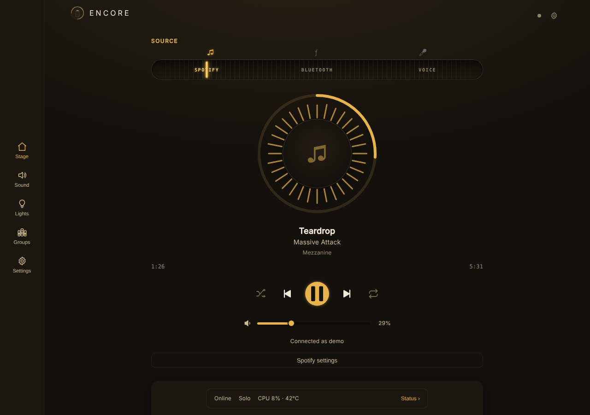
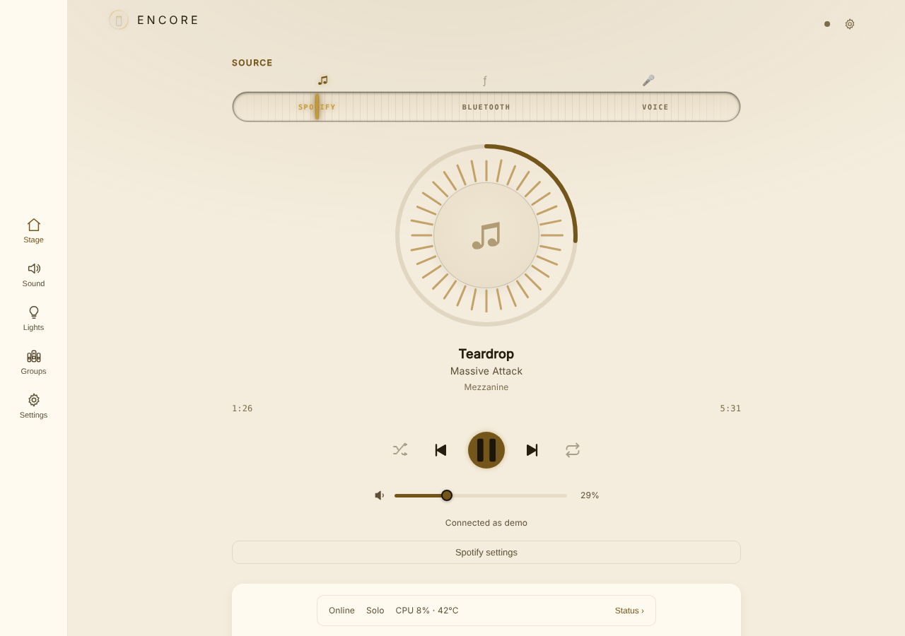
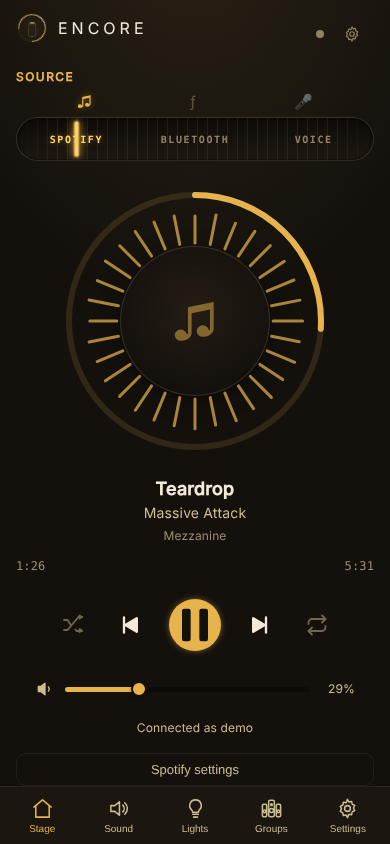
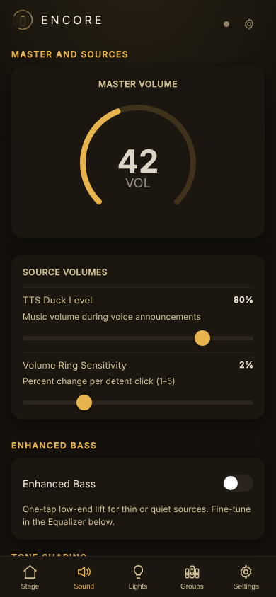
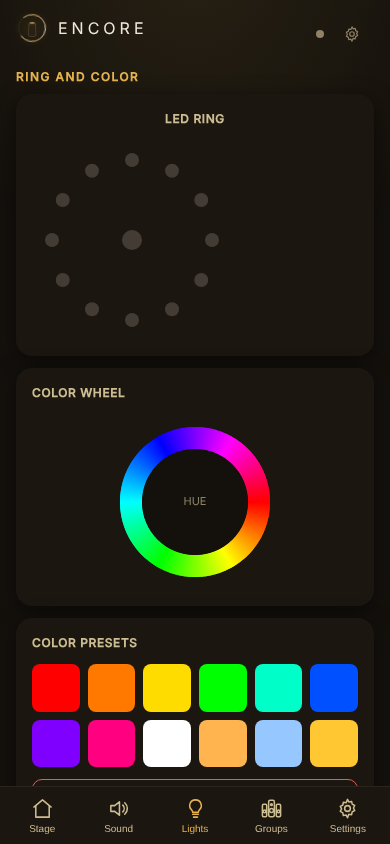
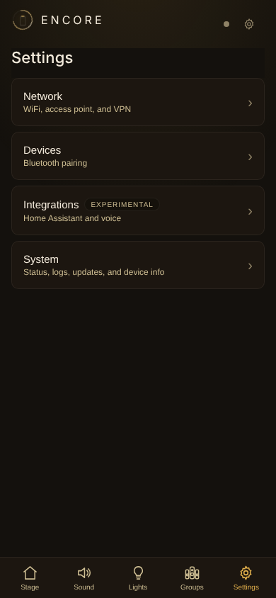
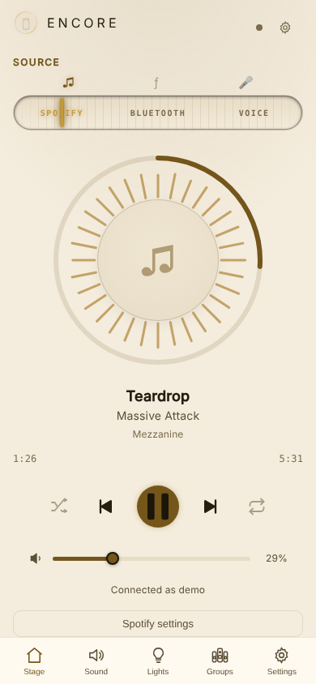
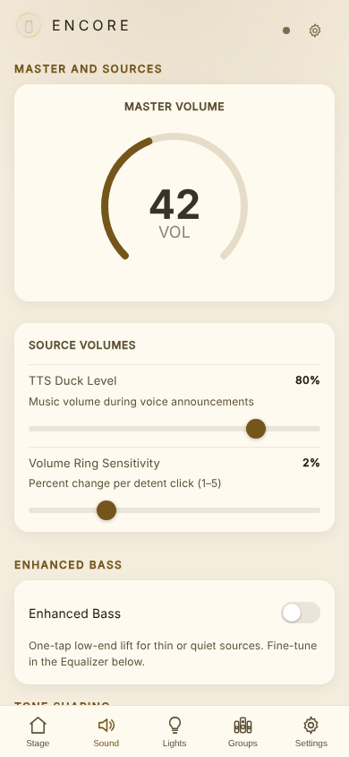
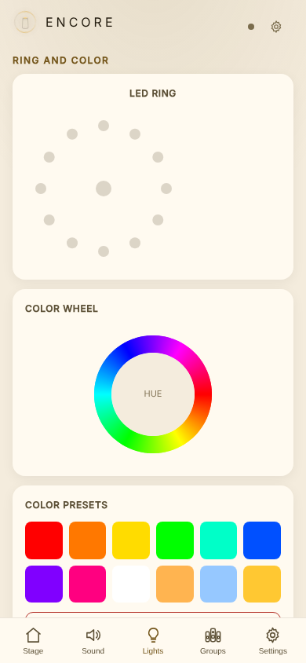
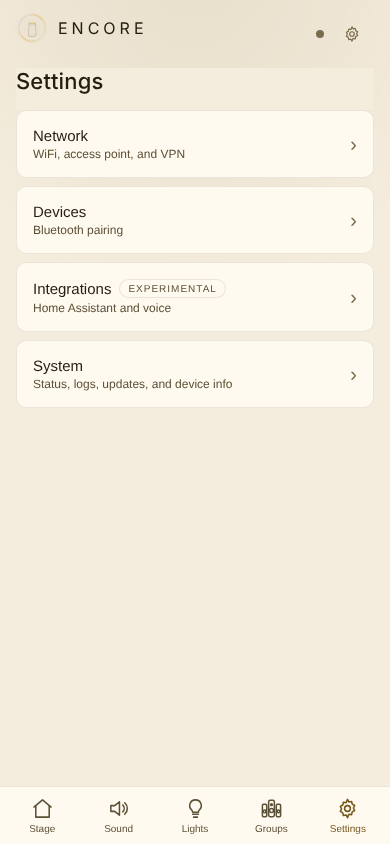

<p align="center">
  <picture>
    <source media="(prefers-color-scheme: dark)" srcset="branding/readme-banner-dark.png">
    <source media="(prefers-color-scheme: light)" srcset="branding/readme-banner-light.png">
    
  </picture>
</p>

<p align="center">
  <a href="https://github.com/ScottNorton/Encore/actions/workflows/ci.yml"></a>
  <a href="https://github.com/ScottNorton/Encore/actions/workflows/release.yml"></a>
  <a href="LICENSE"></a>
  <a href="https://github.com/sponsors/ScottNorton"></a>
</p>

<p align="center"><b>Community firmware for the Harman Kardon Invoke smart speaker.</b></p>

The Invoke was a Cortana speaker sold by Harman Kardon starting in 2017. Microsoft retired
Cortana in January 2021 and a final OTA update reduced the speaker to basic Bluetooth. The
hardware underneath is still good: three drivers, a 7-microphone array, a SHARC DSP, and a
dual-core ARM SoC.

Encore replaces the stock software with a single open-source Rust binary. It adds Spotify
Connect, Bluetooth with aptX HD, multi-room playback, Home Assistant integration, optional
WireGuard remote access, and a web dashboard served from the speaker itself. All of it runs
on the speaker; there is no companion cloud service.

> By flashing this firmware you accept the risks and terms described in [LEGAL.md](LEGAL.md),
> which also covers trademarks, reverse engineering disclosures, and your rights as a device owner.

## Project Status

**Encore is a working hobby project, not a finished product.** It is developed and tested on
one developer's hardware, and most features are first working implementations rather than
hardened subsystems. Treat every feature below as "works for the developer" until more
people have flashed it and reported back. What this project can promise is documentation: the
hardware, protocols, and boot chain are written up in enough detail that you can learn how
the device works and pick up where the current work stops.

| Area | Status |
|------|--------|
| Spotify Connect, Bluetooth A2DP, web dashboard, LED ring, OTA updates | Working on real hardware |
| Multi-speaker groups, WireGuard VPN, desktop/Android app | Implemented, lightly tested |
| Home Assistant (MQTT) | Proof of concept: tested against a live Home Assistant instance with a single speaker. Group entities untested |
| Wyoming voice satellite | Implemented, **not yet validated end-to-end against a live instance** |
| Wake word detection | Framework only. The built-in detector is a stub that never triggers; it needs a real engine |
| Linux 6.1 kernel via kexec | Research in progress, documented in [docs/kernel-porting.md](docs/kernel-porting.md) |

Bug reports from other hardware are among the most useful contributions this project can get.

## How this started

I had an Invoke sitting around and wanted to make something of it. The way in came from
[coggy9](https://github.com/coggy9)'s [HKHacking](https://github.com/coggy9/HKHacking)
research, which showed the device could be opened up in the first place.

The first version was only ever meant for me: a personal voice assistant, my own little
Jarvis, running on hardware I already had. The further I got, the more it looked like
something other people could use too, so I changed course and built it to be shared. That
is why the whole thing is in here, the dashboard and the docs and the reverse engineering
notes, not just the pieces I needed for myself.

It is still mostly first-pass work (see [Project Status](#project-status)), but the point
now is to be a foundation other people can learn from and build on.

## Features

### Spotify Connect

The Invoke appears as a Spotify Connect device on your network, built on
[librespot](https://github.com/librespot-org/librespot). Open Spotify on any device, pick
the speaker, and play.

### Bluetooth A2DP

Stream from any Bluetooth device. Encore supports aptX HD, aptX, and SBC. The Bluetooth stack
talks to the kernel directly over raw HCI/L2CAP sockets, with no BlueZ daemon on the device.

### Web Dashboard

A single-page app compiled to WebAssembly, embedded in the firmware binary, and served from
the speaker. Setup wizard, network configuration, Bluetooth pairing, EQ, LED animation editor,
Spotify controls, speaker grouping, logs, and OTA updates all live here. It also installs as
a PWA on a phone or desktop, and it comes in dark and light themes or follows your device.

<p align="center">
  
  
</p>
<p align="center">
  
  
  
  
</p>
<p align="center">
  
  
  
  
</p>

<sub>Captured from the dashboard's demo mode: add <code>?demo</code> to its URL and it fills in
sample playback and system data, so it runs in a browser without a speaker.</sub>

### Desktop & Mobile App

The same dashboard packaged as a standalone app via [Tauri v2](https://v2.tauri.app/), with
mDNS speaker discovery. Windows and Android builds are tested; macOS, Linux, and iOS are
supported by Tauri but untested here. See [docs/app.md](docs/app.md).

### Multi-Speaker Groups

Multiple Invokes can play in sync: mDNS discovery, leader election, clock synchronization,
and a jitter buffer with drift correction. Speakers can be assigned stereo, left, or right
channels to form pairs. See [docs/groups.md](docs/groups.md).

### Home Assistant (experimental)

> Proof-of-concept stage: tested against a live Home Assistant instance with a single
> speaker. The group-related entities have not been tested. Feedback is welcome.

MQTT integration with auto-discovery. The speaker registers as a media player, light
(LED ring), and sensors in Home Assistant. See [docs/home-assistant.md](docs/home-assistant.md).

### Wyoming Voice Satellite (experimental)

> Implemented but not yet validated against a live Home Assistant instance.

The speaker runs a [Wyoming protocol](https://www.home-assistant.io/integrations/wyoming/)
satellite on port 10700. Microphone audio comes from the DSP's beamformed output through a
native ALSA capture path. Speech-to-text and text-to-speech run on your Home Assistant server.

### LED Ring

Control of 13 RGB LEDs (12 ring + 1 center) at 30 fps through the MCU, plus the Bluetooth
indicator LED via a separate MCU command. Built-in animations, a custom frame-sequence editor
in the dashboard, and Home Assistant access for notification effects.

### Network

First boot brings up a setup AP (`Invoke-XXXX`, unique per device). A captive portal opens
the dashboard, you enter WiFi credentials, and the speaker joins your network and announces
itself as `encore.local` via mDNS. WireGuard
([boringtun](https://github.com/cloudflare/boringtun)) is available for remote access. A USB
RNDIS gadget exposes the speaker at `10.55.55.1` over a USB cable, independent of WiFi, for
setup and recovery (see [docs/usb-access.md](docs/usb-access.md)).

### Recovery

The design goal is that a bad rootfs or a crashing build should never leave the device
unrecoverable, and so far that has held:

- A hardware watchdog reboots the device if Encore hangs.
- A supervisor script quarantines a binary that crashes at boot and falls back to the
  known-good copy on the rootfs.
- If both crash, the device enters safe mode: the watchdog stays fed, the AP stays up,
  and SSH remains available for recovery.
- No update path writes the bootloader or kernel partitions, so USB boot recovery is
  always available.

The bootloader itself is the one thing with no safety net. Nothing in this project touches
it; you shouldn't either.

## Architecture

<p align="center">
  <picture>
    <source media="(prefers-color-scheme: dark)" srcset="branding/logo-mark-dark.png">
    <source media="(prefers-color-scheme: light)" srcset="branding/logo-mark-light.png">
    
  </picture>
</p>

Encore is one statically linked ARM binary (musl) that manages a set of async subsystems
on the Invoke's dual-core Cortex-A7. Measured on the developer's device, idle usage sits
around 40 MB of RAM and a few percent CPU, and Spotify playback at maximum quality averages
about 20% across both cores.

| Subsystem | Purpose | Auto-Restart |
|-----------|---------|:---:|
| MCU | I2C hardware control: touch ring, DAC, IO expander, DSP firmware upload | |
| Audio | Direct ALSA PCM (48 kHz, 32-bit stereo), lock-free mixer, capture path, resampler | Yes |
| Network | WiFi (wpa_supplicant), access point, firewall, mDNS | Yes |
| Web | HTTPS server, REST API, WebSocket, embedded WASM dashboard | Yes |
| Watchdog | SoC hardware watchdog, 10 s pet interval (the MCU has no watchdog of its own) | Yes |
| Spotify | Spotify Connect via librespot | |
| Bluetooth | A2DP sink: aptX HD, aptX, SBC over raw kernel sockets | |
| Wyoming | Voice satellite (TCP port 10700), mic streaming | |
| Home Assistant | MQTT bridge with auto-discovery | |
| VPN | WireGuard tunnel via boringtun | |
| LED | Ring animations at 30 fps, MCU button events | |
| Group | Multi-speaker synchronized playback | |
| Wake Word | Detection framework (stub detector, needs an engine) | |

Subsystems marked auto-restart recover from crashes automatically. The audio mixer is
lock-free (ring buffers, no mutexes on the real-time path) and mixes four sources with
automatic ducking during voice playback.

```
encore/                   Rust workspace
  crates/
    encore-firmware/      On-device binary (ARM musl)
    encore-common/        Shared types: config schema, WebSocket protocol
    encore-wasm/          WASM dashboard, served from the device or wrapped by the app
    encore-app/           Desktop/mobile app, Tauri v2 wrapper
  web/                    PWA shell: HTML, manifest, service worker, icons
rootfs/                   Filesystem overlay merged onto the stock rootfs at build
tools/                    C source for boot helpers (i2c_mute)
scripts/                  Build, deployment, and reverse engineering tools
docs/                     Guides and hardware research
uboot/                    USB-boot files go here (user-supplied, see flashing guide)
```

## Hardware

> Components identified on the developer's device. Other units may vary by revision.

| | |
|---|---|
| **SoC** | Marvell BG2CDP (88DE3006), dual-core Cortex-A7 @ 1.3 GHz, 512 MB RAM, 512 MB NAND |
| **Audio Output** | 3 drivers, TI PCM5121 DAC, TI TPA3116 Class-D amplifier |
| **Audio Input** | 7 MEMS microphones with DSP beamforming |
| **DSP** | Analog Devices ADSP-21489 SHARC @ 450 MHz, firmware uploaded over SPI at every boot |
| **Wireless** | Marvell 88W8887: dual-band WiFi (STA+AP) and Bluetooth 4.1 + BLE |
| **Controls** | Volume ring (infinite rotation), touch surface (tap/hold), mic mute, Bluetooth and reset buttons |
| **LEDs** | 15 RGB total: 13 frame-controlled, Bluetooth indicator via MCU command, 1 not yet mapped |
| **MCU** | TI MSP430FR5739 (FRAM), I2C slave for LEDs, buttons, and touch input |
| **Kernel** | Linux 3.8.13, RSA-signature-verified on NAND. Replaceable at runtime via the [kexec module](docs/kexec-method.md) (research in progress) |

See [docs/hardware.md](docs/hardware.md) for the full peripheral map, I2C bus layout, GPIO
assignments, and audio signal path.

## Getting Started

### What You Need

- A Harman Kardon Invoke (any revision)
- A computer with Linux or [WSL2](https://learn.microsoft.com/en-us/windows/wsl/install) (Ubuntu) for firmware packaging
- A USB-A to USB Mini-B cable (first flash only)
- [Rust](https://rustup.rs/) with `cargo-zigbuild` and `wasm-pack`

### Build

```bash
make download      # fetch the stock firmware image (required base, ~69 MB)
make encore        # WASM dashboard + ARM binary
make firmware      # full flashable image (Linux/WSL); also creates a TLS key pair in build/tls/
make app           # optional: desktop app installer
```

See [docs/build-guide.md](docs/build-guide.md) for prerequisites and details.

### Flash

The first flash uses USB boot mode and the USB-boot files from Harman's final OTA package,
which is not distributed in this repo. The [flashing guide](docs/flashing.md) explains where
to get it and how to set up the `uboot/` directory. After the first flash, updates are over
the air:

1. Open the dashboard's Update tab
2. Upload `rootfs.squashfs` for a full system update, or just the Encore binary for a
   firmware-only update
3. The speaker flashes itself and reboots

### First Boot

1. Connect to the `Invoke-XXXX` WiFi network (password: `ridiculous`)
2. The captive portal opens the setup wizard (or browse to `http://192.168.43.1`)
3. Enter your WiFi credentials
4. The speaker joins your network and appears at `http://encore.local`

Alternatively, connect a USB cable from your computer to the speaker's USB Mini-B port. The
speaker comes up as a USB network adapter at `10.55.55.1` with the dashboard at
`http://10.55.55.1/` and SSH at `root@10.55.55.1`. This needs no WiFi and comes up at boot,
so it also works as a recovery path when WiFi or the access point is down. See
[docs/usb-access.md](docs/usb-access.md).

Root SSH is available at the speaker's IP (user `root`, password `ridiculous`). The
credentials are the same on every Encore device, so change the password if your network
isn't trusted. See [SECURITY.md](.github/SECURITY.md).

### Going Back to Stock

Flash the stock `83_IMAGE` from Harman's OTA2 package using the same USB boot procedure in
the [flashing guide](docs/flashing.md). The kernel and bootloader are never modified, so a
stock rootfs flash returns the device to its factory state.

## Documentation

Guides for using and building Encore:

| Guide | |
|-------|-|
| [Build Guide](docs/build-guide.md) | Toolchain setup, end-to-end build |
| [Flashing](docs/flashing.md) | USB boot, OTA updates, recovery |
| [USB Access](docs/usb-access.md) | Reach the speaker over USB at `10.55.55.1` (dashboard, SSH, recovery) |
| [Configuration](docs/config-reference.md) | Complete config.toml reference |
| [Home Assistant](docs/home-assistant.md) | MQTT setup, entities, example automations |
| [Groups](docs/groups.md) | Multi-speaker playback setup |
| [Desktop & Mobile App](docs/app.md) | App usage and builds |
| [Troubleshooting](docs/troubleshooting.md) | Common issues, crash diagnostics, recovery |

Hardware research and reverse engineering references, for anyone who wants to understand or
extend the platform:

| Reference | |
|-----------|-|
| [Architecture](docs/architecture.md) | Boot sequence, subsystem lifecycle, init system |
| [Hardware](docs/hardware.md) | SoC peripherals, buses, audio signal path, partitions |
| [MCU Reference](docs/mcu-reference.md) | MSP430 I2C protocol, LED frame format, firmware update protocol |
| [DSP Reference](docs/dsp-reference.md) | SHARC architecture, SPI boot protocol, firmware analysis |
| [DSP Tools](docs/dsp-tools.md) | Custom SHARC assembler/disassembler, firmware workflow |
| [Kernel Porting](docs/kernel-porting.md) | Boot security analysis, Linux 6.1 porting status |
| [Kexec Method](docs/kexec-method.md) | Runtime kernel replacement, research log |
| [Porting Status](docs/encore-porting-status.md) | Stock component cross-reference audit |

## Credits

Built on [librespot](https://github.com/librespot-org/librespot),
[Tokio](https://tokio.rs/) and [Axum](https://github.com/tokio-rs/axum),
[boringtun](https://github.com/cloudflare/boringtun),
[wasm-pack](https://rustwasm.github.io/wasm-pack/), and [Zig](https://ziglang.org/) for
cross-compilation.

Thanks to [coggy9](https://github.com/coggy9)'s
[HKHacking](https://github.com/coggy9/HKHacking) repo and community for the early
groundwork, and to Harman for publishing the GPL kernel source, which made serious firmware
work on this device possible.

## Contributing

Contributions are welcome: code, documentation, testing on other hardware revisions, and
hardware discoveries. See [CONTRIBUTING.md](CONTRIBUTING.md). Areas where help matters most:

- **Audio sources**: AirPlay, DLNA, Chromecast Audio
- **Wake word**: the detection framework needs a real engine (openWakeWord or similar)
- **DSP**: custom audio processing on the ADSP-21489 (the toolchain for it is in this repo)
- **Testing**: Home Assistant and Wyoming end-to-end validation, other hardware revisions

## Legal

This is an independent community project. It is not affiliated with, endorsed by, or
associated with Harman International, Samsung, or Microsoft. No proprietary firmware is
distributed in this repository; the build process requires the user's own copy of the stock
firmware image. See [LEGAL.md](LEGAL.md) for trademark notices, reverse engineering
disclosures, and third-party attribution.

## License

Copyright (C) 2026 Scott Norton and contributors.

Encore's code is free software: you can redistribute it and modify it under the terms of the
[GNU General Public License](LICENSE) as published by the Free Software Foundation, either
version 3 of the License, or (at your option) any later version. It is distributed in the hope
that it will be useful, but without any warranty. The documentation in `docs/` is licensed
under [CC BY-SA 4.0](https://creativecommons.org/licenses/by-sa/4.0/).

The stock firmware itself (the kernel image, the bootloader, and the vendor's userland) is not
in this repository. A few pieces from other projects are, each under its own license: the
Bluetooth codecs, the dashboard font, the USB gadget kernel modules, and some Marvell WLAN
configuration files. [LEGAL.md](LEGAL.md) lists them and says where their source is.
