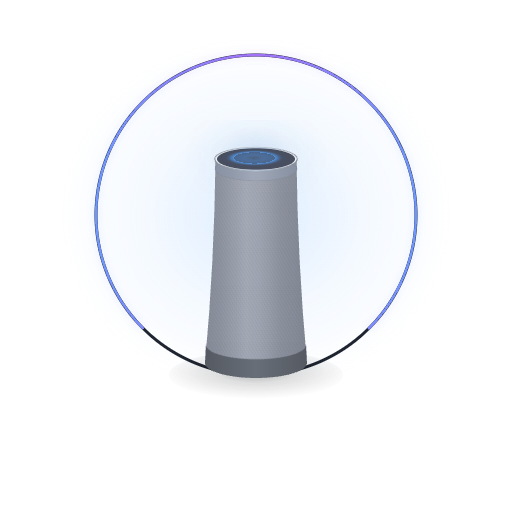
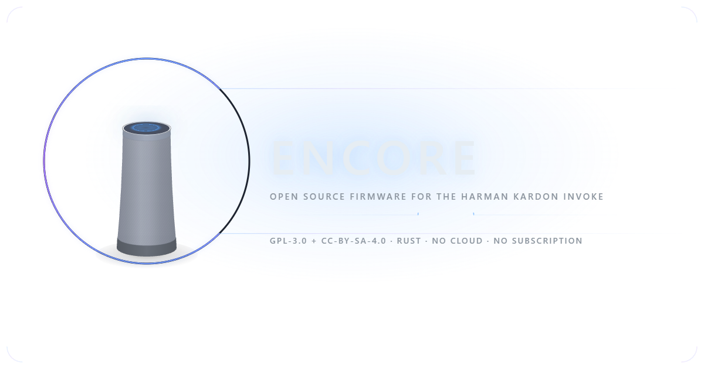

<p align="center">
  <picture>
    <source media="(prefers-color-scheme: dark)" srcset="branding/readme-banner-dark.png">
    <source media="(prefers-color-scheme: light)" srcset="branding/readme-banner-light.png">
    
  </picture>
</p>

<p align="center">
  <a href="https://github.com/ScottNorton/Encore/actions/workflows/ci.yml"></a>
  <a href="https://github.com/ScottNorton/Encore/actions/workflows/release.yml"></a>
  <a href="LICENSE"></a>
  <a href="https://github.com/sponsors/ScottNorton"></a>
</p>

<p align="center"><b>Community firmware for the Harman Kardon Invoke smart speaker.</b></p>

In 2017, Harman Kardon released the Invoke together with Microsoft. Microsoft brought it to life with Cortana, 
making it one of the first super-premium retail smart speakers on the market. Unfortunately, In January 2021, Microsoft retired Cortana. The Invoke was included, owners were offered a $50 gift card. Invokes were 'un-smarted' to Bluetooth-only overnight by an OTA auto update.

**Encore wakes them up again.**

This is a drop-in replacement with a single
open-source Rust binary that runs entirely on your local network. Spotify Connect, VPN,
Bluetooth streaming, Home Assistant integration, including a real-time web dashboard you can
install as an app on your phone or PC.

No cloud dependency. Use your secure home VPN to access your local assistant remotely.
No subscription. No telemetry. No one deciding your speaker's fate from a boardroom.
Your hardware, your rules.

**Please consider forking and contributing!**

Thanks to Harman Kardon for openly sharing the kernel source and tools making this possible,
and to [coggy9](https://github.com/coggy9)'s
[HKHacking](https://github.com/coggy9/HKHacking) repository and community efforts that helped get this project off the ground!

**This is what smart speakers were supposed to be.**

---

## Features

### Spotify Connect

The Invoke appears as a native Spotify Connect speaker on your network. Open
Spotify on any device, pick the Invoke, and play. Built on
[librespot](https://github.com/librespot-org/librespot) — no account linking,
no pairing ceremony, no app to install. It just works.

### Bluetooth A2DP

Stream from any Bluetooth device. The firmware introduces high-quality
codec support. aptX HD, aptX, and SBC. This is a massive improvement over stock!

### Home Assistant (experimental)

> **Note:** This integration has not yet been tested with a live Home Assistant
> instance. The MQTT protocol and auto-discovery payloads are implemented but
> should be considered experimental until validated end-to-end.

Full [MQTT](https://www.home-assistant.io/integrations/mqtt/) integration with
auto-discovery. The Invoke registers itself as a media player, light (LED ring),
and sensor (volume, playback state) in Home Assistant. Control your speaker from
dashboards, automations, or voice commands through your own HA instance.

### Wyoming Voice Satellite (experimental)

> **Note:** This integration has not yet been tested with a live Home Assistant
> instance. The Wyoming protocol handshake and audio streaming are implemented
> but should be considered experimental until validated end-to-end.

The Invoke becomes a
[Wyoming voice satellite](https://www.home-assistant.io/integrations/wyoming/)
for Home Assistant. The 7-microphone array and onboard SHARC DSP handle
far-field voice capture with hardware beamforming and noise suppression. Speech
processing happens on your Home Assistant server.

### Web Dashboard

Invokes running Encore get it a full-featured web app built entirely in Rust and compiled to WebAssembly, embedded in firmware binary, and served from the speaker itself. Network configuration, bluetooth setup, and over-the-air firmware updates can be done through this, and offers everything the speaker is capable of under Encore. Link the output of two or more speakers, create LED ring animation preview and editor for silent Home Assistant notifications, Spotify playback controls, check system logs. It's all done here.

### Desktop & Mobile App

The same WASM dashboard packaged as a standalone app via
[Tauri v2](https://v2.tauri.app/). No browser needed. Launch the app, enter your speaker's IP or discover all speakers on your network automatically. It's the full dashboard experience on your desktop or phone, but requires separate updates.

See [docs/app.md](docs/app.md) for usage, platform support, and build
instructions.

### Multi-Speaker Groups

Link multiple Invokes for synchronized playback across rooms. Speakers
discover each other via mDNS, elect a leader, and stream audio with clock
synchronization and jitter buffering. Assign channels for stereo pair, left,
or right.

See [docs/groups.md](docs/groups.md) for usage.

### LED Ring

Control the 13-LED RGB light ring with smooth 30fps animations, all driven by the MCU. 
Built-in presets — breathe, spin, pulse, volume arc, boot surge — or design your own custom frame sequences. Home Assistant has access to all animations for routines.

### Network

Connect to `Invoke-XXXX`
(unique per device), a captive portal opens, enter your WiFi credentials, done. Once on your network,
the speaker announces itself via mDNS at `encore.local`. Optional WireGuard VPN
for secure remote access through [boringtun](https://github.com/cloudflare/boringtun).

### Reliability

A hardware watchdog prevents hangs — if Encore stops responding, the speaker
reboots automatically. If Encore crashes even once at boot, the system falls
back to the stable binary. You cannot brick the speaker by running
experimental firmware. You can't even brick it by replacing the kernel.

**Just don't try to mess with the bootloader, it might not be safe**

> By using this firmware and flashing it to your device, you acknowledge there
> are risks and agree to the terms in [LEGAL.md](LEGAL.md).

---

## Encore's Architecture

<p align="center">
  <picture>
    <source media="(prefers-color-scheme: dark)" srcset="branding/logo-mark-dark.png">
    <source media="(prefers-color-scheme: light)" srcset="branding/logo-mark-light.png">
    
  </picture>
</p>

>Encore is a single statically-linked ARM-compiled Rust binary.
It manages 13 async subsystems and runs efficiently on the Invoke's dual-core ARM Cortex-A7 with 512 MB of RAM. Average usage is around ~40mb and ~3% CPU combined usage across both cores at idle. While Spotify is playing at the highest quality available, CPU usage is ~20% between both cores. There is headroom for more subsystems.

| Subsystem | Purpose | Auto-Restart |
|-----------|---------|:---:|
| MCU | I2C hardware control — touch ring, DAC, IO expander, DSP firmware upload | |
| Audio | Direct ALSA PCM (48 kHz, 32-bit stereo), lock-free mixer, resampler | Yes |
| Network | WiFi (wpa_supplicant), access point, firewall, mDNS | Yes |
| Web | HTTPS server, REST API, WebSocket, embedded WASM dashboard | Yes |
| Watchdog | Hardware watchdog (10s pet) + MCU heartbeat (30s) | Yes |
| Spotify | Spotify Connect via librespot, mDNS discovery | |
| Bluetooth | A2DP sink — aptX HD, aptX, SBC (raw kernel sockets) | |
| Wyoming | Voice satellite (TCP port 10700), audio streaming | |
| Home Assistant | MQTT bridge with auto-discovery | |
| VPN | WireGuard tunnel via boringtun | |
| LED | 15 LEDs (13 controlled), ring animations at 30 fps | |
| Group | Multi-speaker synchronized playback across LAN | |
| Wake Word | Pluggable wake word detection framework | |

Vital subsystems (marked auto-restart) recover automatically from crashes. The
audio mixer runs lock-free with ring buffers — no mutexes on the real-time path.
Four concurrent audio sources (Spotify, Bluetooth, Wyoming, system sounds) mix
with automatic volume ducking.

```
encore/                   Rust workspace
  crates/
    encore-firmware/      On-device binary (ARM musl, ~6.6 MB)
    encore-common/        Shared types — config schema, WebSocket protocol
    encore-wasm/           WASM dashboard — Canvas 2D graphics, no JS deps
    encore-app/           Desktop/mobile app — Tauri v2 wrapper
  web/                    PWA shell — HTML, manifest, service worker, icons
rootfs/                   Filesystem overlay (merged onto stock rootfs at build)
  sbin/                   Boot scripts, supervisor, network setup
  usr/bin/                Encore binary + boot helpers
  etc/                    Init scripts
tools/                    C source for boot helpers (i2c_mute)
scripts/                  Build, deployment, and reverse-engineering tools
docs/                     Hardware specs, build guide, architecture, RE findings
flash/                    USB boot flashing tools
```

---

## Hardware

> Components identified on the developer's device. Other units may vary by
> hardware revision.

| | |
|---|---|
| **SoC** | Marvell BG2CDP (88DE3006) — dual-core Cortex-A7 @ 1.3 GHz, 512 MB RAM, 512 MB NAND |
| **Audio Output** | 3 drivers, TI TAS5756M DAC, Class-D amplifier |
| **Audio Input** | 7 MEMS microphones with DSP beamforming and noise suppression |
| **DSP** | Analog Devices ADSP-21489 SHARC @ 450 MHz — firmware uploaded via SPI at each boot |
| **Wireless** | Marvell 88W8887 — dual-band WiFi (2.4/5 GHz, STA+AP), Bluetooth 4.1 + BLE |
| **Controls** | Volume ring (infinite rotation, no detent), proximity sensor (tap/hold), mic mute button, Bluetooth button (control mechanism unknown) |
| **LEDs** | 15 RGB total; 13 controlled (12 ring + 1 top center), 2 uncontrolled (including BT indicator) |
| **MCU** | TI MSP430FR5739 (FRAM) — I2C slave, manages LEDs and touch input |
| **Kernel** | Linux 3.8.13 (stock, signature-locked on NAND — replaceable at runtime via [kexec module](docs/kexec-method.md)) |

See [docs/hardware.md](docs/hardware.md) for the full peripheral map, I2C bus
layout, GPIO assignments, and audio signal path.

---

## Getting Started

### What You Need

- A Harman Kardon Invoke (any hardware revision, any original firmware version)
- A computer with Linux or [WSL2](https://learn.microsoft.com/en-us/windows/wsl/install) (Ubuntu)
- A USB-A to USB Mini-B cable (for first-time flashing only)
- [Rust](https://rustup.rs/) with `cargo-zigbuild` and `wasm-pack` installed

### Build

```bash
# Build Encore — compiles the WASM dashboard and cross-compiles the ARM binary
make encore

# Build the full firmware image (runs in WSL, packages rootfs into flashable image)
make firmware

# Build desktop app (Windows installer)
make app

# Build Android app (APK, requires additional deps)
make app-android
```

See [docs/build-guide.md](docs/build-guide.md) for prerequisites and detailed
build instructions.

### Flash

**First time — USB boot:**

1. Connect the USB cable to your PC
2. Enter USB boot mode: plug in power while holding reset, then press mic-mute
   4 times rapidly
3. Run `flash\run.bat` from Windows
4. At the U-Boot prompt, type `tftp2nand -d <size> 0x7000000` (size is printed
   at the end of the build)
5. Type `reset` — the speaker reboots into Encore

**After that — OTA via web dashboard:**

1. Open the Encore dashboard (Update tab)
2. Upload `firmware/rootfs.squashfs` for a full system update, or just the Encore
   binary for a quick firmware-only update
3. The speaker flashes and reboots automatically

See [docs/flashing.md](docs/flashing.md) for recovery procedures and
troubleshooting.

### First Boot

1. On your phone or computer, connect to the `Invoke-XXXX` WiFi network
   (password: `ridiculous`) — XXXX is unique to your device
2. A captive portal opens automatically — or navigate to `http://192.168.43.1`
3. Enter your home WiFi credentials in the setup wizard
4. The speaker reboots, joins your network, and appears at `http://encore.local`

Root SSH is available at the speaker's IP address (user: `root`, password:
`ridiculous`).

---

## Documentation

| Guide | |
|-------|-|
| [Build Guide](docs/build-guide.md) | Prerequisites, toolchain setup, end-to-end build |
| [Flashing](docs/flashing.md) | USB boot mode, OTA updates, recovery |
| [Hardware](docs/hardware.md) | SoC peripherals, audio signal path, partition layout |
| [Architecture](docs/architecture.md) | Boot sequence, subsystem lifecycle, init system |
| [Home Assistant](docs/home-assistant.md) | MQTT auto-discovery, entities, example automations |
| [DSP Reference](docs/dsp-reference.md) | ADSP-21489 SHARC architecture, SPI boot protocol |
| [DSP Tools](docs/dsp-tools.md) | Disassembler, assembler, firmware analysis workflow |
| [MCU Reference](docs/mcu-reference.md) | MSP430 I2C protocol, LED animation binary format |
| [Configuration](docs/config-reference.md) | Complete config.toml reference with all options |
| [Desktop & Mobile App](docs/app.md) | Standalone app usage, platforms, build instructions |
| [Groups](docs/groups.md) | Multi-speaker synchronized playback setup and configuration |
| [Kernel Porting](docs/kernel-porting.md) | Boot security analysis, kexec module, Linux 6.1 porting |
| [Kexec Method](docs/kexec-method.md) | Runtime kernel replacement via loadable module |
| [Troubleshooting](docs/troubleshooting.md) | Common issues, crash diagnostics, recovery procedures |

---

## Acknowledgments

<p align="center">
  <picture>
    <source media="(prefers-color-scheme: dark)" srcset="branding/og-card-dark.png">
    <source media="(prefers-color-scheme: light)" srcset="branding/og-card-light.png">
    
  </picture>
</p>

This project exists because two companies built something worth saving.

**Harman Kardon** designed extraordinary audio hardware. The Invoke's
three-driver array, TI DAC, and acoustic engineering deliver sound
quality that rivals speakers at twice the price. Years after discontinuation,
the hardware hasn't aged a day. They built something that lasts.

**Microsoft** did something rare and commendable: they shipped the Invoke with
a Linux-based firmware, published the kernel source, and left the boot process
accessible enough that a community could pick up where they left off. Whether
that door was left open by design or by fortune, it made this entire project
possible. Not every company gives their hardware a second chance at life — and
we're grateful.

Together, they created a speaker that deserved better than a retirement notice
and a gift card. Encore is our way of making sure it gets that.

---

This project also stands on the shoulders of exceptional open-source work:

- [librespot](https://github.com/librespot-org/librespot) — Spotify Connect protocol
- [Tokio](https://tokio.rs/) and [Axum](https://github.com/tokio-rs/axum) — async runtime and web framework
- [boringtun](https://github.com/cloudflare/boringtun) — WireGuard implementation
- [wasm-pack](https://rustwasm.github.io/wasm-pack/) — WebAssembly toolchain
- [Zig](https://ziglang.org/) — cross-compilation toolchain

---

## Contributing

Contributions are welcome — from code to documentation to hardware discoveries.
See [CONTRIBUTING.md](CONTRIBUTING.md) for development setup and guidelines.

Areas where help is especially valuable:

- **Audio sources** — AirPlay, DLNA, Chromecast Audio
- **DSP** — the ADSP-21489 SHARC is a powerful DSP with room for custom audio
  processing, but its application firmware is largely undocumented
- **Wake word** — custom wake word detection (the framework exists, needs an engine)
- **Documentation** — setup guides, teardown photos, translations

---

## Legal

This is an independent community project. It is not affiliated with, endorsed
by, or associated with Harman International, Samsung, or Microsoft. See
[LEGAL.md](LEGAL.md) for trademark notices, reverse engineering disclosures,
and third-party attribution.

No proprietary firmware is distributed in this repository.

---

## License

[GPL-3.0](LICENSE) — code.
[CC BY-SA 4.0](https://creativecommons.org/licenses/by-sa/4.0/) — documentation.

All community-authored code in this repository is released under the GNU General
Public License v3.0. Documentation, protocol specifications, and hardware
research in `docs/` are licensed under Creative Commons Attribution-ShareAlike
4.0. Stock firmware components (kernel, bootloader, wireless drivers) remain the
property of their respective copyright holders and are not included in this
repository.
