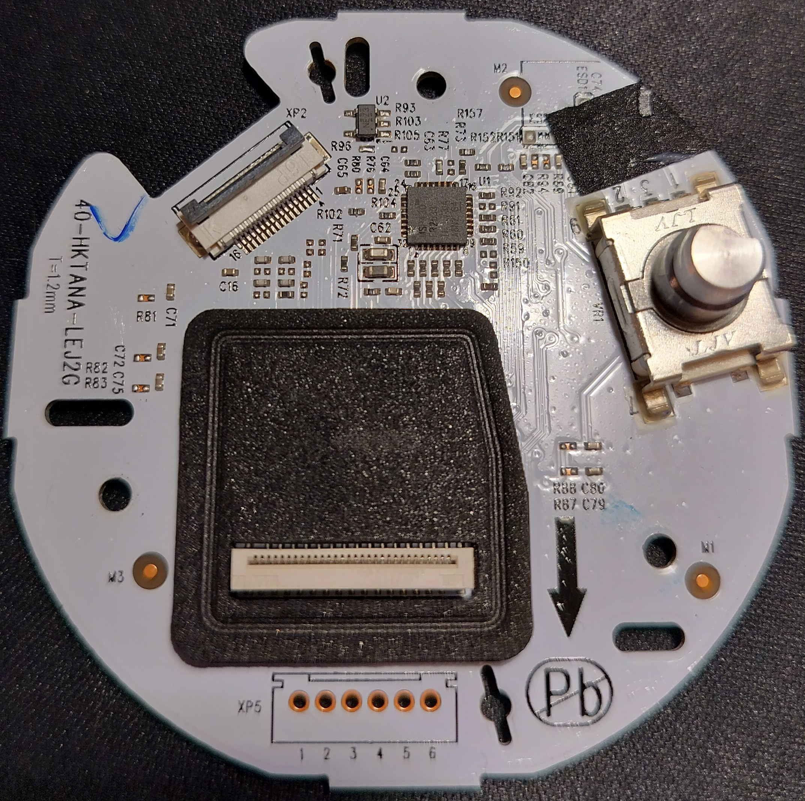

# Hardware Reference

> **Note**: The components listed here were identified on the developer's own
> device through physical inspection, I2C bus scanning, and tool use. Other Harman Kardon Invoke units may have different hardware revisions
> or component substitutions.

## System-on-Chip

| Property | Value |
|----------|-------|
| SoC | Marvell BG2CDP (88DE3006), silicon revision B0 |
| Module | Libre Wireless LS9AD-AC11DBT-GV |
| CPU | 2x ARM Cortex-A7 @ 1.3GHz (dual-core) |
| ISA | ARMv7-A with NEON, VFPv4, Thumb-2 |
| RAM | 512MB DDR3 |
| Flash | 512MB NAND — single Toshiba chip (flash ID da98, ext ID 1590). Page 2048, OOB 64. Berlin NFC driver creates two MTD views: single-plane (128KB erase) and SLC-mode (64KB erase) — same physical chip, different access modes |
| PMIC | Marvell 88PG868 |
| Kernel | Linux 3.8.13 (RSA signature-locked on NAND, replaceable at runtime via kexec module) |

## SoC Peripheral Map

The 88DE3006 exposes the following buses. Marvell calls their I2C implementation "TWSI" (Two Wire Serial Interface) — `/dev/twsi0` through `/dev/twsi3` appear in the stock ramdisk's `ueventd.rc`, but Linux maps them to standard `/dev/i2c-N` nodes. Only I2C-0 and SPI-0 are used by the Harman Kardon Invoke carrier board:

| Bus | Dev Node | Status | Usage |
|-----|----------|--------|-------|
| I2C-0 | `/dev/i2c-0` | Active | Audio hardware (DAC, IO Expander), MCU. MMIO at 0xF7FC6000 |
| I2C-1 | — | Not enabled | MMIO at 0xF7FC7000. Dmesg: `Unknown Synopsys component type: 0x00000000` — clock not enabled |
| I2C-2 | — | Not enabled | MMIO at 0xF7FC8000. Dmesg: `Unknown Synopsys component type: 0x00000000` — clock not enabled |
| SPI-0 | `/dev/spidev0.0` | Active | DSP firmware upload + messaging |
| SPI-1 | — | Pins on connector | GPIO5/8/9/10 — not wired on HK board |
| UART-0 | `/dev/ttyS0` | Console | Debug serial (115200 baud) |
| UART-1 | `/dev/ttyS1` | Not initialized | MMIO at 0xF7FCA000, `uart:unknown` — clock/pinmux not configured by kernel |
| UART-2 | `/dev/ttyS2` | Not wired | No MMIO address |
| UART-3 | `/dev/ttyS3` | Not wired | No MMIO address |
| USB 2.0 OTG | `/dev/bus/usb` | Active | USB-mini port (flashing, mass storage, ADB). UDC at 0xF7ED0100 (4 endpoints), PHY at 0xF7B74000. Android composite gadget with ACM + ADB + FFS functions. Ramdisk `inittab` runs getty on `/dev/ttyGS0` (CDC ACM serial); main rootfs `init.rc` only activates ADB (ACM configured but not in active function list) |
| SDIO | Internal | Active | Marvell 88W8887 WiFi+BT combo (in Libre Wireless LS9AD module) |
| GPIO | sysfs | Partial | 4 banks of 32 (128 total), see GPIO section |
| Watchdog | `/dev/watchdog` | Active | Hardware watchdog, Encore pets every 10s |
| GPU | — | Not used | Vivante GC600 at 0xF7BC0000 (IRQ 52), Galcore v5.0.11.17486. Stock ramdisk has full libGAL.so/libGLESv2.so/libEGL.so (unused on Invoke) |
| HDMI 1.4 TX | — | Not wired | SoC has full HDMI+CEC; not routed on HK board |
| SPDIF | — | Muxed | Shares I2S TXD pin; mutually exclusive with I2S |

### GPIO Banks

| Chip | Base | Count | Label |
|------|------|-------|-------|
| gpiochip0 | 0 | 32 | gpio_soc_0 |
| gpiochip32 | 32 | 32 | gpio_soc_1 |
| gpiochip64 | 64 | 32 | gpio_soc_2 |
| gpiochip96 | 96 | 32 | gpio_soc_3 |

### GPIO Pin Assignments

| GPIO | Direction | Purpose |
|------|-----------|---------|
| 3 | Input | MCU interrupt line (falling edge, epoll) |
| 4 | Output | DSP SPI flow control — CS toggle before reads |
| 12 | Input | DSP SPI flow control — DSP has data to send |
| 13 | Output | DSP SPI flow control — ARM ready to communicate |
| 15 | Input | DSP SPI flow control — DSP ready to receive |

GPIO 3 is exported by the kernel. GPIOs 4, 12, 13, 15 are exported at runtime
by Encore for DSP bidirectional SPI messaging.

## Audio Path

```
7x MEMS Mics → DSP (ADSP-21489 SHARC) → WM8904 Codec → SoC I2S → ALSA
SoC I2S → WM8904 → DSP → TAS5756M DAC (I2C 0x4C) → Amp → 3x Speakers
```

### Components

| Component | Chip | Interface | Purpose |
|-----------|------|-----------|---------|
| **DSP** | Analog Devices ADSP-21489 (SHARC) | SPI (spidev0.0) | 7-mic beamforming, wake word, volume, mic mute |
| **DAC** | TI TAS5756M (PCM512x family) | I2C 0x4C | Audio DAC with miniDSP (10-band parametric EQ, 3-band DRC) |
| **Codec** | Wolfson WM8904 | I2C 0x1A (kernel) | I2S interface between SoC and DSP, ALSA card 1 |
| **IO Expander** | TI PCA9538 | I2C 0x20 | Amp mute, DAC mute, DSP reset |
| **Amplifier** | (on amp board) | Via IO Expander | 3-channel speaker driver |
| **Microphones** | 7x MEMS | DSP SPORT inputs (TDM) | Circular array for 360-degree beamforming |

### ALSA Devices

| Device | Purpose |
|--------|---------|
| `music` | Main audio output (softvol → dmix → hw) |
| `system` | System sounds |
| `voice` | Voice assistant output |
| `timer` | Timer/alarm sounds |

The stock asound.conf defines softvol controls for each device, all routed
through dmix to `hw:0,0`. Encore bypasses the stock ALSA config and writes
directly to the PCM device at 48kHz S32_LE with its own lock-free mixer.

### DSP (ADSP-21489 SHARC)

Located on the amplifier board (separate PCB at the bottom of the device).
See [docs/dsp-reference.md](dsp-reference.md) for complete documentation.

Key facts:
- 450 MHz SIMD core, 5 Mbit SRAM, hardware FFT/FIR/IIR accelerators
- Firmware uploaded via SPI every cold boot (no persistent storage, cannot be bricked)
- Performs 7-mic beamforming (binary-quantized delay-and-sum), wake word detection, and VAD
- Bidirectional SPI protocol with GPIO flow control (pins 4, 12, 13, 15)
- Full memory dump capability (320 pages, ~640 KB)
- **Completely disassembled**: 25,363 instructions from .ldr, 59,850 from SRAM dump
- Custom assembler + disassembler toolchain enables custom DSP firmware development

## Controls

- **Volume Ring**: Physical rotating ring on top, infinite rotation with no detent, generates VolumeUp/VolumeDown events via MCU
- **Proximity Sensor**: Top center surface, registers tap and hold — full capabilities unknown
- **Bluetooth Button**: MCU reports short and long press events. Bluetooth LED controlled via MCU I2C command 0x0B (byte1=1 on, byte1=0 off), read-back via 0x0C
- **Mic Mute Button**: On back panel, toggles mic array
- **Reset Button**: Recessed on back panel, short and long press events
- **LED Ring**: 15 RGB LEDs total; 13 controlled via 39-byte I2C frames (12 ring + 1 top center). Bluetooth indicator LED controlled via MCU I2C command 0x0B. 1 additional LED — control mechanism unknown


## MCU (TI MSP430FR5739)



Located at the top of the device, near the LED ring and touch surface. Handles
all user-facing I/O: LED ring, buttons, touch panel, volume ring, and proximity
sensor. Communicates with the ARM SoC over I2C bus 0 at address 0x36.

| Property | Value |
|----------|-------|
| Chip | **TI MSP430FR5739** |
| Architecture | 16-bit RISC, FRAM-based (ferroelectric RAM) |
| Original Firmware | `cortana_mcu.bin` (13,312 bytes, ~143 functions) |
| Code FRAM | 0xCC00-0xFFFF (13,312 bytes) |
| Data FRAM | 0xC200-0xCBFF (3,072 bytes — strings, lookup tables, factory-programmed) |
| SRAM | 0x1C00-0x1FFF (1 KB) |
| I2C | eUSCI_B0 slave at 0x36, pins P2.2 (SDA) / P2.3 (SCL) |
| UART | eUSCI_A0 debug console (ring buffer, command processor, might be hard wired to SoC) |
| Debug | JTAG or Spy-Bi-Wire (2-pin SBW) — NOT SWD |
| Interrupt | GPIO 3 on ARM SoC (falling edge) |

### MCU Protocol

6-byte I2C messages in both directions:
- **Write** (ARM → MCU): command byte + 5 data bytes
- **Read** (MCU → ARM): event type + 5 data bytes

See [MCU Reference](mcu-reference.md) for the complete protocol specification
including LED animation format, button events, and firmware update procedure.

### MCU Firmware Update

The MCU firmware can be updated over I2C using commands 0x12 (data blocks)
and 0x11 (CRC verify). **WARNING**: A bad flash bricks the touch/LED/button
subsystem permanently. The stock MCU firmware works correctly — do not update
unless you have a known-good replacement and JTAG recovery capability.

## I2C Bus

All hardware is on I2C bus 0 (`/dev/i2c-0`):

| Address | Device | Status | Notes |
|---------|--------|--------|-------|
| 0x10 | — | **Not a device** | Bitmask artifact on IO Expander 0x20 scan. Zero references in any binary. |
| 0x19 | Marvell 88PG868 PMIC | Kernel-managed | CPU voltage regulator (BUCK1=VDD_CPU, reg 0x24) |
| 0x1A | Wolfson WM8904 | Kernel-managed | Audio codec (ALSA driver) |
| 0x20 | TI PCA9538 IO Expander | Fully controlled | Amp mute (bit 1), DAC mute (bit 2), DSP reset (bit 0), DSP power (bits 3-4) |
| 0x36 | TI MSP430FR5739 MCU | Fully controlled | LED ring, buttons, volume ring, touch, proximity |
| 0x48 | (pad exists) | Low priority | Temperature sensor footprint, needs hwmon driver tsen-adc33.c |
| 0x4C | TI TAS5756M DAC | Fully controlled | Audio DAC with miniDSP EQ/DRC |
| 0x64 | — | **Unused** | Zero references in any decompiled binary. Absent or unpopulated. |

### IO Expander (0x20) — Mute & Power Control

| Bit | Mask | Register | Controls | Set (1) | Clear (0) |
|-----|------|----------|----------|---------|-----------|
| 0 | 0x01 | 0x01 | DSP reset | Released (normal) | Held in reset |
| 1 | 0x02 | 0x01 | Amp mute | **MUTED** | **UNMUTED** |
| 2 | 0x04 | 0x01 | DAC mute | **UNMUTED** | **MUTED** |
| 3 | 0x08 | 0x02 | DSP power 2 | Power off | **Power on** |
| 4 | 0x10 | 0x01 | DSP power 1 | Power off | **Power on** |

**DSP power bits are active-low**: clear the bit to enable power, set to disable.
Confirmed from `mcu-interface.c` at 0x000b3a7c (`com.harman.vui.powerdspcontrol` WAMP handler). Bits 3 and 4 span two IO Expander registers (0x01 and 0x02) — the stock code does read-modify-write
on both registers.

**Unmute sequence** (order matters — DAC first to avoid full-power white noise):
1. Read reg 0x01, OR 0x04 (unmute DAC), write back
2. Read reg 0x01, AND 0xFD (unmute AMP), write back

### PMIC (0x19) — Marvell 88PG868

CPU voltage regulator with two buck converters. Only BUCK1 is used on the Invoke.

| Rail | Register | Step | Range (HW) | Range (DT constrained) |
|------|----------|------|------------|----------------------|
| BUCK1 (VDD_CPU) | 0x24 | 25mV (<1.6V), 50mV (≥1.6V) | 0–2.2V | 1.0V–1.35V |
| BUCK2 (unused) | 0x13 | 25mV (<1.6V), 50mV (≥1.6V) | 0–2.2V | Not configured |

**BUCK1 register encoding (0x24):**
- Values 0–10: output disabled (0V)
- Values 11–34: 1.000V + (val-11) × 25mV
- Values 35–47: 1.600V + (val-35) × 50mV

**Voltage at runtime:** Depends on silicon leakage bin (OTP at 0x1010020). The vendor
kernel reads leakage and selects from 6 voltage tiers: 0.975V–1.150V. The `performance`
cpufreq governor keeps the CPU at 1300MHz with V_high (highest tier for the chip).

**Driver:** `drivers/regulator/88pg86x.c` (in both vendor 3.8 and mainline 6.1+).
Mainline uses `compatible = "marvell,88pg868"` with `buck1`/`buck2` subnodes.
Vendor uses `compatible = "marvell,pg86x"` with `BK1_TV`/`BK2_TV` subnodes.

## WiFi/BT Combo Chip (Marvell 88W8887)

The wireless subsystem consists of two layers: the **Libre Wireless LS9AD-AC11DBT-GV**
module (the physical PCB assembly with antennas, RF frontend, and FCC certification)
containing a **Marvell Avastar 88W8887** combo silicon (the actual radio chip). The
"AD" suffix denotes Adaptive Dual-band diversity antenna — 2x antenna diversity for
both 2.4 GHz and 5 GHz bands.

The 88W8887 is a quad-radio chip. Two radios are active; two are unused:

| Radio | Standard | Status | Notes |
|-------|----------|--------|-------|
| WiFi | 802.11a/b/g/n/ac (1x1 MIMO) | **Active** | `mlan.ko` + `sd8xxx.ko` |
| Bluetooth | v4.1 + Low Energy (BLE) | **Active** | `bt8xxx.ko` |
| NFC | — | Unknown | Silicon supports it (`drv_mode` bit 2), module may not break out antenna.  (if exists, likely ribbon cable top of the device connected to the MCU/led ring board) |
| FM Receive | — | Unknown | Silicon supports it (`drv_mode` bit 1), module may not break out antenna |

The same BG2CDP + 88W8887 combo is used in the Chromecast 2 and Google Home (first
generation).

### WiFi Driver Architecture

The WiFi stack uses Marvell's custom vendor driver (NOT mainline `mwifiex`):

| Module | Source | Purpose |
|--------|--------|---------|
| `mlan.ko` | `vendor/kernel/.../wlan_sd8887/mlan/` | MAC layer — 802.11 protocol, commands, events, power management |
| `sd8xxx.ko` | `vendor/kernel/.../wlan_sd8887/mlinux/` | SDIO transport + Linux netdev glue (depends on mlan.ko) |

The driver creates two interfaces:
- `wlan0` — Station mode (connects to your network)
- `p2p0` — uAP mode (always-on `Invoke-XXXX` access point)

### WiFi Firmware & Calibration Files

| File | Size | Purpose |
|------|------|---------|
| `sd8887_wlan_a2_p78.bin` | 373 KB | WiFi firmware (A2 silicon, P78 variant) |
| `WlanCalData_ext-LS9AD-20160725.conf` | 1.6 KB | RF calibration data (LS9AD module-specific, required) |
| `txpwrlimit_cfg_8887.bin` | 9 KB | TX power limits per channel/band (regulatory compliance) |

All stored at `/lib/firmware/mrvl/` on device.

### WiFi Driver Parameters

Set at module load time via `insmod sd8xxx.ko param=value`. The stock boot script
(`wpa_supplicant_setup.sh`) loads with these parameters:

```
insmod mlan.ko
insmod sd8xxx.ko \
    cal_data_cfg=mrvl/WlanCalData_ext-LS9AD-20160725.conf \
    txpwrlimit_cfg=mrvl/txpwrlimit_cfg_8887.bin \
    cfg80211_wext=0xf \
    auto_ds=2 \
    fw_serial=1 \
    sta_name="wlan" \
    uap_name="p2p" \
    fw_name=mrvl/sd8887_wlan_a2_p78.bin \
    ps_mode=2 \
    max_sta_bss=1 \
    max_uap_bss=1 \
    drvdbg=0x7 \
    antenna_div=1 \
    module_rev=22
```

#### Key Parameter Reference

| Parameter | Stock Value | Purpose |
|-----------|-------------|---------|
| `ps_mode` | 2 | Power save: 0=driver default, 1=IEEE PS enabled, 2=PS disabled |
| `auto_ds` | 2 | Auto deep sleep: 0=driver default, 1=enabled, 2=disabled |
| `cfg80211_wext` | 0xf | Bit 0: STA WEXT, bit 1: uAP WEXT, bit 2: STA CFG80211, bit 3: uAP CFG80211. 0xf = all enabled |
| `antenna_div` | 1 | Antenna diversity enabled (auto-switch between 2 antennas) |
| `module_rev` | 22 | LS9AD module revision (2.2) |
| `drvdbg` | 0x7 | Debug: MMSG + MFATAL + MERROR |
| `max_sta_bss` | 1 | Maximum 1 station interface |
| `max_uap_bss` | 1 | Maximum 1 access point interface |
| `fw_serial` | 1 | Serial firmware download (not parallel) |
| `drv_mode` | 7 (default) | Bit 0: STA, bit 1: uAP, bit 2: WiFi Direct. 7 = all modes |

#### Post-Load Tuning (stock boot script)

After module load, the stock `wpa_supplicant_setup.sh` applies:

```bash
# HT capability (802.11n high-throughput config)
mlanutl wlan0 htcapinfo 0x800000 2

# Receive Packet Steering — distribute RX interrupts to both CPU cores
echo "3" > /sys/class/net/wlan0/queues/rx-0/rps_cpus
echo "3" > /sys/class/net/wlan0/queues/rx-1/rps_cpus
echo "3" > /sys/class/net/wlan0/queues/rx-2/rps_cpus
echo "3" > /sys/class/net/wlan0/queues/rx-3/rps_cpus
```

The RPS CPU mask `3` (binary `11`) steers RX packets to both Cortex-A7 cores.
Without this, all WiFi RX interrupts hit a single core, which can cause latency
spikes on a dual-core system running audio simultaneously.

#### Power Management States

The driver has two independent power-saving mechanisms:

**PS Mode** (IEEE 802.11 Power Save):
- `ps_state=0`: Awake — actively transmitting/receiving
- `ps_state=1`: Pre-sleep — about to enter sleep
- `ps_state=2`: Sleep confirm — sleep handshake with AP
- `ps_state=3`: Asleep — wakes on beacon or buffered data from AP

**Deep Sleep** (SDIO-level):
- More aggressive than PS mode — powers down most of the chip
- Default idle timeout ~100ms before entering deep sleep
- Wakeup latency higher than PS mode

Monitor live power state: `cat /proc/mwlan/wlan0/debug` shows `ps_mode`, `ps_state`,
`is_deep_sleep`, and `wakeup_dev_req`.

#### Runtime Control (iwpriv)

Selected useful commands (full list in vendor driver README):

| Command | Example | Purpose |
|---------|---------|---------|
| `iwpriv wlan0 deepsleep 0` | Disable deep sleep | Reduces latency, increases power |
| `iwpriv wlan0 deepsleep 1 100` | Enable, 100ms idle | Default deep sleep config |
| `iwpriv wlan0 getsignal 1 2` | Get avg RSSI | Signal quality monitoring |
| `iwpriv wlan0 drvdbg 0x20037` | Verbose debug | Adds command + event hex dumps |
| `mlanutl wlan0 htcapinfo` | Get HT capabilities | 802.11n config |

### WiFi MAC Address

The stock MAC is `00:50:43:02:fe:01` (Marvell OUI default, indicates OTP not
programmed). The boot script handles this:
1. Reads MAC from `/sys/class/net/wlan0/address`
2. If default MAC → checks `/factory_setting/WIFI_MAC_ADDR` for stored MAC
3. If no stored MAC → generates random `00:50:43:XX:XX:XX` and stores it
4. Sets MAC via `ifconfig wlan0 hw ether <MAC>`

### Single-Radio Band Constraint

The 88W8887 has a single radio shared between STA and uAP modes. It **cannot
operate STA and AP on different frequency bands simultaneously**. If STA connects
on 5 GHz while AP runs on 2.4 GHz (or vice versa), the driver kills the AP after
~35 seconds. Encore handles this by restarting the AP on the same band as the STA
connection after WiFi associates.

### Bluetooth

| Property | Value |
|----------|-------|
| Standard | Bluetooth v4.1 + Low Energy (BLE) |
| Profiles | A2DP 1.2, AVRCP 1.3, SPP, HFP, HSP, HOGP |
| Kernel module | `bt8xxx.ko` (in-tree, Marvell vendor driver) |
| BT firmware | `sd8887_bt_a2.bin` (258 KB) / `sd8887_bt_a2_new.bin` (181 KB) |
| Module params | `drv_mode` (bit 0: BT, bit 1: FM, bit 2: NFC), `fw_name`, `bt_mac`, `psmode` |

The BT radio is confirmed working: `insmod bt8xxx.ko drv_mode=1` creates
`/sys/class/bluetooth/hci0`. The stock MAC is `00:00:00:00:00:00` and must be
assigned (WiFi MAC +1).

Encore uses raw kernel sockets (HCI management + L2CAP) to control Bluetooth
directly. A2DP sink with aptX HD, aptX, and
SBC codecs is fully functional. This is a major improvement over stock which has no high-definition bluetooth audio.

## Watchdog

Hardware watchdog at `/dev/watchdog` (DesignWare WDT at SoC address 0xF7FC2000).
Opening the device starts the timer; writing any byte resets it (CRR write 0x76).
If the process dies without closing the fd, the device reboots. Encore pets the
watchdog every 10 seconds. Encore also sends MCU I2C command 0x24 every 30 seconds
(stock sent it every 5 seconds), but this is a confirmed NO-OP — the MCU firmware
dispatcher ignores command 0x24 entirely, and the MCU's own WDT_A is stopped at
boot. The SoC hardware watchdog is the only real reset source.

## NAND Partition Layout

| MTD | Name | Size | Content |
|-----|------|------|---------|
| 0 | bootloader | 4MB | Marvell bootloader |
| 1 | sysinit | 256KB | Early init |
| 2 | kernel | 4MB | Encrypted zImage + DTB |
| 3 | rootfs | 44.2MB (stock), expandable to 84.8MB | SquashFS filesystem (this is what we replace) |
| 4 | factory_setting | 8MB | Factory calibration (yaffs2, mounted at /factory_setting). Contains `MAC_ADDR`, `WIFI_MAC_ADDR`, SSL certs, U-Boot env vars |
| 5-10 | various | | Recovery, logs, etc. |
| 11 | lsync | ~32MB | Persistent user data (yaffs2, mounted at /lsync) |

NAND timing registers: `ndtr0=84840A12`, `ndtr1=00208662`. 3 bad blocks observed in scan.
The NAND controller uses a DMA engine called "NFC" in dmesg (`NFC DMA engine init`). This is the
**NAND Flash Controller**, not Near Field Communication. The driver is `pxa3xx_nand` (Marvell/PXA family).

The rootfs partition (MTD 3) is the only one we modify. The stock firmware
allocates 44.2MB for rootfs, but the NAND supports up to 84.8MB —
`package_rootfs.py` auto-expands the partition header when the custom rootfs
exceeds the stock size. Trailing partitions are preserved at their new offset.

The kernel on NAND is RSA signature-verified by the bootloader and cannot be reflashed,
but it can be replaced at runtime via the kexec module. See [kexec-method.md](kexec-method.md).

NAND partition table is NOT parsed by the kernel at boot — `mount_part` reads a "version table"
from `/dev/mtd1` and creates MTD sub-partitions in userspace.

## Memory Layout

| Region | Physical Address | Size | Description |
|--------|-----------------|------|-------------|
| Boot ROM / reserved | 0x00000000 | 17 MB | Boot ROM, SoC internals |
| PHYS_OFFSET | 0x01100000 | 15 MB | Bootloader, shared mem |
| Main RAM | 0x02000000 | 512 MB | DDR3, kernel at 0x02008000 |
| SHM region 1 | 0x12000000 | 214 MB | Galois SHM driver — AMP/fusion IPC |
| SHM region 2 | 0x1F600000 | 9 MB | Galois SHM driver — AMP/fusion IPC |

Linux sees **248 MB** (MemTotal: 253952 kB). The SHM regions (214 + 9 = 223 MB) are reserved
for Marvell's AMP framework and IPC with the **ZSP media co-processor** (Xtensa-based, MMIO
0xF7C00000). The ZSP handles video decode/post-processing on Berlin media players via ICC
(Inter-CPU Communication) message queues through shared memory. On the Invoke (no display),
the ZSP is almost certainly idle — the SHM is reserved but wasted. The stock `ampservice`
process (438 MB VSIZE) maps these regions. The 6.1 kernel does not need them and can reclaim
the full 512 MB.

Stock kernel cmdline: `console=ttyS0,115200 root=/dev/ram initrd=0x08000000,35497472 usb_host_port_num=3-7.3`
(initrd at 0x08000000 = 33.8 MB ramdisk, USB hub path 3-7.3)

Stock PMIC reading: `vcpu: 1000 <--> 1350 mV at 1150 mV`, leakage value 179 (OTP).

## Network

See [WiFi/BT Combo Chip](#wifibt-combo-chip-marvell-88w8887) above for chip details,
driver parameters, and firmware files.

### Interfaces

| Interface | Mode | IP Range | Purpose |
|-----------|------|----------|---------|
| `wlan0` | Station | DHCP from router | Connects to user's WiFi network |
| `p2p0` | uAP (Access Point) | 192.168.43.0/27 | Always-on `Invoke-XXXX` for setup and emergency access |

### WiFi Boot Sequence

1. `mount_partition.sh` launches `wpa_supplicant_setup.sh`, `start_ap.sh`, and `auto_wifi_firewall.sh` in parallel
2. `wpa_supplicant_setup.sh`: loads `mlan.ko` + `sd8xxx.ko`, waits for `wlan0`, sets MAC, configures RPS + HT capabilities, copies wpa_supplicant config, signals ready
3. `start_ap.sh`: waits for `p2p0`, detects STA band, starts hostapd (falls back to uAP firmware mode if hostapd fails)
4. `auto_wifi_firewall.sh`: configures wpa_supplicant networks from Encore config, applies firewall rules
5. Encore starts after all three scripts and monitors the WiFi state machine

### wpa_supplicant

- Binary: `/bin/wpa_supplicant` (stock, compiled with nl80211 driver)
- Config: `/data/wifi/wpa_supplicant.conf` (copied from `/system/etc/wpa_supplicant.conf.in` at boot)
- Template: `ctrl_interface=/data/wifi`, `update_config=1`, `country=US`
- Control socket: `/data/wifi/wlan0` (wpa_cli connects here)
- Networks are added dynamically via `wpa_cli` commands from Encore

### DHCP

- Client: `dhcpcd` with `-B --noarp -h encore` (no ARP probe, hostname "encore")
- Server (AP mode): `dnsmasq` or `dhcpd` — range 192.168.43.100-155, 12h lease
- Config: `/etc/dhcpcd/dhcpcd.conf` — `noipv6rs`, requests only subnet/router/DNS

### Access Point

- SSID: `Invoke-XXXX` (last 4 hex of WiFi MAC, unique per device, WPA2 passphrase: `ridiculous`)
- Primary: `hostapd` on `p2p0` with band-matched channel (same band as STA connection)
- Fallback: Marvell uAP firmware mode via `uaputl.exe` (open network, no WPA2 — emergency only)
- IP: 192.168.43.1/27, dnsmasq for DHCP + captive portal DNS redirect

## Board Layout

The Harman Kardon Invoke has two main PCBs connected by flex cables:

### Main Board
- Marvell BG2CDP SoC (ARM Cortex-A7 dual-core), silicon revision B0
- Libre Wireless LS9AD module (WiFi + BT; silicon supports NFC and FM radio but module likely does not break out antennas for them)
- NAND flash (top)
- RAM (bottom)


### Amplifier Board
- Analog Devices ADSP-21489 SHARC DSP (part marking: AD91210Z)
- TI TAS5756M DAC
- TI PCA9538 IO Expander
- Wolfson WM8904 codec


