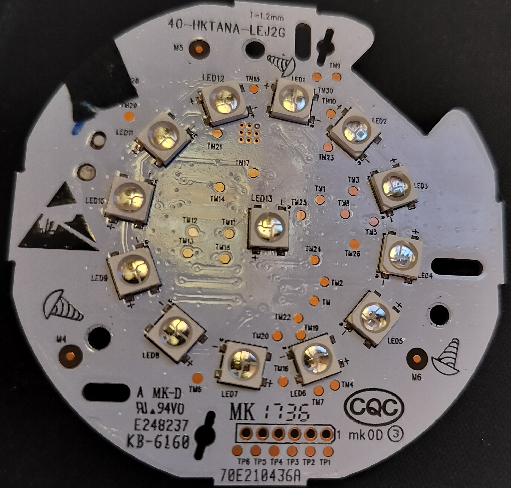

# MCU Reference — TI MSP430FR5739

Complete technical reference for the TI MSP430FR5739 microcontroller on the
Harman Kardon Invoke. Located at the top of the device near the LED ring and touch surface.
Handles all user-facing I/O.

Derived from MSP430 disassembly of `cortana_mcu.bin` (13,312 bytes), Ghidra
decompilation of the `mcu-interface` ARM binary, and cross-referencing both.
Confirmed against the MSP430FR5739 datasheet.

## Chip Identification

| Property | Value |
|----------|-------|
| Chip | **TI MSP430FR5739** |
| Family | MSP430FR57xx (FRAM-based, 16-bit RISC) |
| Firmware | `cortana_mcu.bin` (13,312 bytes, ~143 functions) |
| Location | Main board, top of device, near LED ring |
| Debug | JTAG or Spy-Bi-Wire (2-pin SBW), not SWD |
| Instruction set | 16-bit, little-endian (RET=0x4130, CALL=0x12B0) |

Confirmed as MSP430FR5739 (not STM32, not generic MSP430) by matching
peripheral register base addresses in the disassembled firmware:
- eUSCI_A0 (UART) at 0x0500 — unique to FR5739
- eUSCI_B0 (I2C) at 0x0540 — unique to FR5739

Note: the DSP chip on the amp board (AD91210Z = Analog Devices ADSP-21489 SHARC)
is a separate device — not the MCU.

### Memory Map

| Region | Address Range | Size | Content |
|--------|--------------|------|---------|
| Code FRAM | 0xCC00 - 0xFFFF | 13,312 bytes | Firmware binary (= `cortana_mcu.bin`) |
| Data FRAM | 0xC200 - 0xCBFF | 3,072 bytes | Strings, lookup tables, factory-programmed (NOT in .bin file) |
| SRAM | 0x1C00 - 0x27FF | 3,072 bytes | Runtime variables (see RAM Map below) |
| IVT | 0xFFD8 - 0xFFFF | 40 bytes | Interrupt vector table |

Note: the 0xCC00-0xD1FF region contains BOTH data tables AND executable code.
The disassembler boundary at 0xD200 is NOT a clean code/data split.

### Key Peripherals

| Peripheral | Base Address | Function |
|-----------|-------------|----------|
| eUSCI_A0 | 0x0500 | UART debug console (ring buffer, command processor) |
| eUSCI_B0 | 0x0540 | I2C slave (address 0x36, pins P2.2/P2.3) |
| Timer0_A | — | General timing, debounce |
| Timer1_A | — | LED PWM (~8kHz) |
| WDT_A | 0x01C0 | **Stopped at boot** (WDTHOLD=1) — not used for anything (see below) |
| GPIO | — | Button inputs, LED data |

### WDT_A — Stopped at Boot

The MCU's WDT_A is **stopped at boot** — the reset code at 0xFE44 writes 0x5A80
(WDTPW + WDTHOLD) to WDTCTL at 0x01CC, which halts the watchdog timer. It is
never re-enabled. Only 3 references to WDTCTL (0x01CC) exist in the entire firmware,
all in a single function that saves, stops, and restores — a standard MSP430
peripheral-safe pattern, not active use. The WDT IVT entry (0xFFE8) points to
ISR_default_trap (0xF73E), confirming WDT interrupts never fire.

LED PWM uses Timer1_A (~8kHz), not WDT_A. There is no MCU-side watchdog reset
capability. The SoC's DesignWare WDT at 0xF7FC2000 is the actual system reset
source (pet via CRR write 0x76 to 0xF7FC200C).

MCU command 0x24 ("heartbeat") is a confirmed **NO-OP** — the MCU firmware
dispatcher falls through to default (stack cleanup + return).

### I2C Configuration

| Register | Value | Meaning |
|----------|-------|---------|
| UCB0I2COA0 | 0x0436 | OAEN (enable) + slave address 0x36 |
| UCB0IE | 0x0B | Enable RX, TX, and START interrupts |
| P2SEL | bits 2-3 | Route P2.2 (SDA) and P2.3 (SCL) to eUSCI_B0 |

Note: the disassembly mislabels 0x056C as UCB0IE (actually UCB0IFG) and 0x056A
as UCB0I2CSA (actually UCB0IE).

### I2C ISR State Machine (at 0xE9E6)

3-state machine driven by UCB0IFG (0x056C), state variable at RAM 0x247E:

| State | UCB0IFG Flag | Action |
|-------|-------------|--------|
| 0 (idle) | RXIFG (bit 0) | Read UCB0RXBUF, call byte processor (0xD838) |
| 0 (idle) | TXIFG (bit 1) | Call TX getter (0xEE16), write UCB0TXBUF |
| 1 (TX active) | TXIFG | Send next response byte |
| 1 (TX active) | STPIFG (bit 3) | Call message complete (0xDDB0) |
| 2 (RX multi-byte) | RXIFG | Buffer received byte |
| 2 (RX multi-byte) | STPIFG | Clear flag, process complete message |
| 2 (RX multi-byte) | TXIFG | Error: debug print, select response buffer |

Response buffers: A=0x253C, B=0x2548, C=0x2542 (A/B selected by sub-state
0x247F; C used in error path).

### Interrupt Vector Table

| Address | Vector | Handler | Purpose |
|---------|--------|---------|---------|
| 0xFFD8 | Timer1_A | 0xF0A6 | LED PWM (~8kHz) |
| 0xFFE0 | Timer0_A | 0xE1E6 | General timing |
| 0xFFE4 | eUSCI_B0 | 0xE7D8 | I2C slave (state machine at 0xE9E6) |
| 0xFFF4 | Reserved | 0xECD0 | Reserved_FFF4 |
| 0xFFFE | Reset | 0xF61C | Reset vector → `_c_int00` |

IVT anomaly: the eUSCI_B0 vector 0xE7D8 falls inside a `call` instruction in
linear disassembly; the I2C state machine at 0xE9E6 ends with `reti` and is the
functional handler.

**ISR_default_trap (0xF73E)**: All unused IVT entries (DMA, eUSCI_A1, Timer0A_CC0,
Comp_D, ADC, etc.) point to 0xF73E. This is NOT a proper trap handler — it's the
tail end of a circular buffer manipulation function. If an unexpected interrupt
fires, it corrupts SRAM by writing to buffer pointers rather than halting. In
practice this is harmless because those peripherals are never enabled, but there
is no safety net for spurious interrupts.

### Boot Sequence

1. **Reset vector** (0xFFFE → 0xF61C): Jumps to `_c_int00`
2. **_c_int00**: Sets SP=0x2800 (top of SRAM), calls `main`
3. **main**: DCO calibration (8MHz), configures GPIOs, initializes eUSCI_A0 (UART) and eUSCI_B0 (I2C slave)
4. **Peripheral init**: Timer0A (general timing), Timer1A (~8kHz LED PWM), ADC, Comparator
5. **Enter LPM0**: `bis #CPUOFF, SR` — purely interrupt-driven from here
6. All work happens in ISRs: I2C commands, UART console, LED animation, button events

### UART Debug Console

The MCU has a UART debug interface (eUSCI_A0 at 0x0500):
- 32-byte ring buffer at 0x23F4, command buffer at 0x2414
- Processes commands on carriage return (CR)
- Prompt: `cortana_mcu #`
- Baud rate and pin assignments unknown (not traced on PCB)

| Command | Action |
|---------|--------|
| `help` | Print command list |
| `ver` | Print firmware version string |
| `reset` | Soft reset MCU |
| `led` | LED test/status |
| `i2c` | I2C bus status |
| `gpio` | GPIO pin state dump |
| `adc` | ADC reading |
| `temp` | Temperature sensor reading |
| `flash` | FRAM status/info |
| `readx` | **Hidden** — reads arbitrary FRAM/memory address (debug backdoor) |

Note: `flash_libre` appears in firmware strings but is a status banner printed
during MCU firmware update operations, not a user command.

### SRAM Map

| Address | Size | Purpose |
|---------|------|---------|
| 0x22BF | 1 | UART init flag |
| 0x22C0 | 1 | Retry/error counter |
| 0x23F4 | 32 | UART debug ring buffer |
| 0x2414 | 32 | UART command buffer |
| 0x247C | 1 | I2C init flag (set by cmd 0x01) |
| 0x247D | 1 | Volume level / last cmd parameter |
| 0x247E | 1 | I2C state (0=idle, 1=TX active, 2=RX multi-byte) |
| 0x247F | 1 | Sub-state / expected remaining bytes |
| 0x2486 | 1 | Mode/state variable (queried in cmd 0x01 response) |
| 0x2487 | 1 | FW upgrade active flag |
| 0x24C8 | 1 | Button event byte 0 (volume direction) |
| 0x24C9 | 1 | Button event byte 1 (volume steps) |
| 0x24DD | 1 | LED animation frame index |
| 0x24E8 | 1 | LED external mode state (4=external active) |
| 0x24E9 | 1 | TX active flag |
| 0x2515 | 1 | Bluetooth LED state (set by cmd 0x0B, queried by cmd 0x0C) |
| 0x2516 | 1 | Mode variable (set by cmd 0x20) |
| 0x2517 | 1 | Ack variable (set by cmd 0x22, queried by cmd 0x23) |
| 0x2518 | 1 | Status variable (queried by cmd 0x26, cleared after read) |
| 0x2524 | 6 | Timer/timeout structure |
| 0x253C | 6 | Response buffer A |
| 0x2542 | 6 | Response buffer C (error path) |
| 0x2544 | 1 | Buffer selector |
| 0x2548 | 6 | Response buffer B |
| 0x2549 | 1 | TX buffer index |
| 0x254C | 2 | TX buffer base address |
| 0x2551 | 1 | LED animation mode |
| 0x256C | 1 | LED index (set by cmd 0x0D) |
| 0x2576 | 2 | Timer comparison value |
| 0x2578 | 2 | Timer current value |
| 0x257A | 2 | Animation frame count |
| 0x257C | 2 | Animation frame counter |
| 0x2581 | 1 | Processing flag |
| 0x2583 | 1 | Command ready flag |
| 0x2587 | 1 | Device color flag (set by cmd 0x25, cleared by cmd 0x01) |
| 0x2588 | 1 | Device color sent flag (cleared by cmd 0x01) |
| 0x2593 | 1 | UART ring buffer read index |
| 0x2594 | 1 | UART ring buffer write index |
| 0x2595 | 1 | UART command buffer write index |
| 0x2618 | 2 | LED buffer base pointer |
| 0x2621 | 1 | Number of active LED channels |
| 0x2622 | 1 | LED animation parameter |
| 0x2623 | 1 | LED idle flag |
| 0x2626+ | 8 | Button mode lookup table (8 entries, indexed by cmd 0x0F byte1) |

## I2C Protocol

Standard commands are 6 bytes. Multi-byte commands exist: 0x0E (41 bytes),
0x11 (6 bytes), 0x12 (129 bytes), raw LED frames (39 bytes). Events
(MCU → ARM) are always 6 bytes.

### Commands (ARM → MCU) — Complete from MCU Firmware RE

Command dispatcher at 0xD5CA. Jump table for cmds 0x01-0x10 at 0xD5F8,
if-else chain for 0x20-0x26.

| Cmd | Handler | Bytes | Purpose | Details |
|-----|---------|-------|---------|---------|
| 0x01 | 0xD76C | 6 | Version/init | Sets init flag 0x247C=1, configures P2DIR, sends version from 0xC404 + mode from 0x2486. Clears flags 0x2587, 0x2588 |
| 0x02 | 0xD79A | 6 | **NO-OP** (DSP power) | Falls through to dispatcher exit. ARM never sends this; DSP power is controlled via IO Expander bits 3-4 directly |
| 0x03 | 0xD75C | 6 | Volume level | Stores byte1 to 0x247D, draws volume arc on LED ring (13 LEDs) |
| 0x04 | 0xD79A | 6 | **NO-OP** | Falls through to dispatcher exit |
| 0x05 | 0xD62C | 6 | LED animation control | Sub-dispatches on byte1: 0x20=enter external mode, 0x21=exit external mode, 0x22=enter FW upgrade mode |
| 0x06 | 0xD79A | 6 | **NO-OP** | Falls through to dispatcher exit |
| 0x07 | 0xD748 | 6 | Query mode | Response: [0x07, 0x256C contents] |
| 0x08 | 0xD742 | 6 | LED fixed pattern | Sets r12=14, calls func_f67a (LED drawing with value 14). ARM sends this with 3s sleep before; not a reset |
| 0x09 | 0xD722 | 6 | RGB LED set | Sets 3 LED channels: byte1=R(ch0), byte2=**G(ch2)**, byte3=**B(ch1)**. G/B swapped in hw channel routing — does NOT affect raw 39-byte frames |
| 0x0A | 0xD718 | 6 | Single LED brightness | Sets brightness for currently selected LED |
| 0x0B | 0xD710 | 6 | **Bluetooth LED** | Stores byte1 to 0x2515 — controls BT indicator LED. byte1=1 on, byte1=0 off. Read-back via 0x0C |
| 0x0C | 0xD6FC | 6 | Query BT LED state | Response: [0x0C, 0x2515 contents] |
| 0x0D | 0xD6F0 | 6 | Set LED index | Selects which LED (0-12) for 0x09/0x0A to address |
| 0x0E | — | 41 | LED reset + frame | Handled in multi-byte RX path (not jump table). See LED protocol below |
| 0x0F | 0xD618 | 6 | Button mode set | Clamps byte1 to max 7, looks up table at 0x2626 |
| 0x10 | 0xD6EC | 6 | Bootloader transition | Sets r12=2, calls func_f67a. ARM sends this after bootloader version response (0x01,0x00), before firmware data upload |
| 0x11 | — | 6 | FW upgrade CRC | `[0x11, size_hi, size_lo, crc_hi, crc_lo, 0x00]` — big-endian. Handled in multi-byte RX path (not jump table) |
| 0x12 | — | 129 | FW data block | Handled in multi-byte RX path (not jump table) |
| 0x14 | — | 6 | **NO-OP** (FW upgrade done) | Not in dispatcher. ARM sends after firmware upgrade completion (success or failure), followed by init sequence |
| 0x20 | 0xD6E0 | 6 | Set mode variable | Stores byte1 to 0x2516 |
| 0x21 | — | — | **NO-OP** | Not in dispatcher |
| 0x22 | 0xD6D8 | 6 | Set ack variable | Stores byte1 to 0x2517 |
| 0x23 | 0xD6C0 | 6 | LED ack query | Response: [0x23, 0x2517 contents] |
| 0x24 | — | — | **NO-OP** | Not in dispatcher at all. "Heartbeat" — MCU ignores completely |
| 0x25 | 0xD6B6 | 6 | Set device color | Sets flag 0x2587=1, configures timer from 0x2564/0x2566 |
| 0x26 | 0xD69E | 6 | Query status | Response: [0x26, 0x2518 contents], clears 0x2518 after read |

Note on 0x0E: the jump table entry for command 0x0E (index 13) is a NO-OP
because 0x0E messages are 41 bytes. The I2C state machine switches to state 2
(RX multi-byte) after receiving the first byte, and the 0x0E handling occurs
in the multi-byte completion path, not through the 6-byte command dispatcher.
Similarly for 0x11 (6 bytes) and 0x12 (129 bytes).

#### Command 0x05 Sub-dispatch

| byte1 | Purpose |
|-------|---------|
| 0x20 | Enter external LED mode (6-byte alternative to `0x0E 0x01 ...`) |
| 0x21 | Exit external LED mode (return to internal/volume arc mode) |
| 0x22 | Enter firmware upgrade mode (sets flag 0x24E8=1) |

#### Commands 0x09/0x0A/0x0D — Individual LED Control

- `0D <index>`: Select LED 0-12 (0-11 = ring, 12 = center)
- `09 <R> <G> <B>`: Set RGB (channel mapping: R=ch0, **G=ch2, B=ch1** — G/B swapped in hw routing; raw 39-byte frames use standard RGB, no swap needed)
- `0A <brightness>`: Set single LED brightness

#### Command 0x0B — Bluetooth LED

Controls the dedicated BT indicator LED. `byte1=1` turns it on, `byte1=0` turns
it off. Read-back via command 0x0C. Cross-referenced with ARM-side
`mcu-interface.c` which calls this for BT pairing/connected states.

This resolves the former "unknown Bluetooth LED mechanism" mystery — it was always
an MCU I2C command.

### Volume Command (0x03) Details

- Byte 1: volume level 0-100 (stock range: 8-78)
- Bytes 2-3: Encore uses a sequence toggle alternating between `AB B6` and `AC BE`; stock ARM code does not explicitly set these bytes (undefined stack contents)
- Stock uses 2 volume units per detent click; events debounced at 800ms
- Volume arc uses LEDs in non-sequential order: `{8, 7, 6, 9, 10, 11, 12, 5}`
  (8 LEDs total, starting from LED 8 bottom-left, wrapping counter-clockwise)
- Volume 0 = no LEDs lit, volume 100 = all 8 lit

### Events (MCU → ARM)

All events are 6 bytes. Button/touch events use byte 0 = 0x04, byte 1 = event code:

| Byte 0 | Byte 1 | Event | Encore `McuEvent` |
|--------|--------|-------|-----------------|
| 0x04 | 0x00 | Touch short press | `TouchShortPress` |
| 0x04 | 0x01 | Touch long press | `TouchLongPress` |
| 0x04 | 0x02 | Bluetooth button short | `BluetoothShort` |
| 0x04 | 0x03 | Bluetooth button long | `BluetoothLong` |
| 0x04 | 0x04 | Mic mute button short | `MicShort` |
| 0x04 | 0x05 | Mic mute button long | `MicLong` |
| 0x04 | 0x06 | Reset button short | `ResetShort` |
| 0x04 | 0x07 | Reset button long | `ResetLong` |
| 0x04 | 0x08 | Volume ring CW | `VolumeUp(n)` (byte 2 = steps) |
| 0x04 | 0x09 | Volume ring CCW | `VolumeDown(n)` (byte 2 = steps) |
| 0x04 | 0x0A | BT + MIC combo long | — (not handled) |
| 0x01 | 0x00 | Bootloader version response | Version in bytes 3-5. ARM responds by sending cmd 0x10 then firmware data |
| 0x01 | 0x01 | App version response | `VersionInfo([b3, b4, b5])` |
| 0x06 | (mode) | Mode response | Second TX response from cmd 0x01 — mode value from SRAM 0x2486 |

### Init Sequence

#### Stock Init (from ARM-side `mcu-interface.c`)

The stock `mcu post init timer` does only:
1. Send version query (`01 00 00 00 00 00`), poll for response (10ms sleep, up to 101 iterations)
2. Read 6-byte version response
3. Send device color (`25 00 00 00 00 00`)
4. Send status query (`26 00 00 00 00 00`), read response

#### Encore Init (enhanced sequence)

Required before LED frames work. Must be performed in this exact order:

1. Send MCU reset: `[0x0E, 0x01, 39x0x00]` (41 bytes), wait 200ms
2. Send version query (`01 00 00 00 00 00`), wait 100ms
3. Read 6-byte version response
4. Send LED acknowledge (`23 00 00 00 6C BA`), wait 50ms
5. Drain all pending events (read 6 bytes in loop until all-zero, max 10 reads)
6. Send device color (`25 00 00 00 00 00`), wait 50ms
7. Send status query (`26 00 00 00 00 00`), wait 50ms, read response

Note: Steps 1, 4, and 5 are Encore additions not present in the stock init.

## LED Ring

### Physical Layout

13 LEDs total: 12 around the ring + 1 center status LED.

```
LEDs 0-11: Ring (12 positions around top)
LED 12:    Center/Status LED (separate from ring)

        LED 0
    LED11   LED 1
  LED10       LED 2
  LED 9       LED 3
    LED 8   LED 4
    LED 7 LED 5
        LED 6
```



### Frame Format

- 39 bytes per frame: 13 LEDs x 3 bytes (R, G, B order)
- Frames persist without refresh (30+ seconds)
- ~0.4% sporadic I2C error rate (errno 121), retry with 20ms backoff

### LED Write Protocol

All LED writes use the `0x0E` prefix protocol. Encore uses the same scheme the stock
firmware did; raw 39-byte frames are never sent (see the collision problem below for why):

```
[0x0E, flag, frame1(39B), frame2(39B), ..., frameN(39B)]
```

| Flag | Meaning |
|------|---------|
| 0x01 | First batch: enter external LED mode (MCU reset) |
| 0x00 | Continuation: stay in external LED mode |

- Up to 10 frames per I2C write (390 bytes + 2 prefix = 392 bytes max)
- Timing: 280ms per batch (~28ms/frame, ~36 FPS)
- The `0x0E` prefix ensures byte 0 of frame data is never at I2C offset 0,
  avoiding collision with MCU command bytes

### First Byte Collision Problem

When sending raw 39-byte frames (without `0x0E` prefix), the MCU interprets
byte 0 of each frame as a command if it matches any entry in the dispatch table.

Complete collision set from MCU firmware RE:
- **Full range**: 0x01-0x10 (jump table), 0x20, 0x22, 0x23, 0x25, 0x26
- **Active (dangerous)**: 0x01, 0x03, 0x05, 0x07-0x0D, 0x0F, 0x10, 0x20, 0x22, 0x23, 0x25, 0x26
- **NO-OPs (safe to collide)**: 0x02, 0x04, 0x06, 0x0E (in jump table), 0x24

This is why the `[0x0E, flag, frames...]` protocol exists. Several of the animation
files on the device contain frame bytes that would collide if sent raw (`L_109_c_announce`,
`L_207_s_incall`, `L_303_d_wificonnected`, `L_404_o_oobesuccess`), so always use the
prefix.

### Animation File Format

The device carries a set of animation files at `/usr/share/lights/` (inherited from the
stock rootfs). They are useful as worked examples if you are building custom animations:

- Raw concatenated 39-byte frames, no header
- `file_size % 39 == 0` always
- 28 files (listening, thinking, speaking, alarm, wifi setup, etc.)
- Playback: batched via the `[0x0E, flag]` prefix, 280ms per 10-frame batch

## MCU Operating Modes

| Mode | Description | How to Enter |
|------|-------------|-------------|
| Internal | MCU handles LED display autonomously (volume arc, idle animations) | Default at boot, or cmd `05 21` |
| External | MCU accepts raw LED frames from ARM | Send `0x0E 0x01` prefix, or cmd `05 20` |

Encore uses external mode exclusively after the init sequence.

## MCU Firmware Update

**WARNING**: A bad MCU flash bricks the touch/LED/button subsystem permanently.
The MCU has no recovery mechanism other than JTAG. The stock firmware works
correctly — do not update unless you have a verified replacement image and
Spy-Bi-Wire/JTAG programmer.

Update protocol (from ARM-side `mcu-interface.c`):
1. ARM receives bootloader version response (0x01, 0x00)
2. ARM sends cmd 0x10 (bootloader transition), waits 1s
3. Send firmware in 128-byte chunks: `[0x12, ...128 data bytes]` (129 total)
4. 10ms delay between chunks
5. After all chunks: `[0x11, size_hi, size_lo, crc_hi, crc_lo, 0x00]` (6 bytes, big-endian)
6. CRC-16/DNP variant (init 0xFFFF, byte-swap + XOR + nibble-shift per byte)
7. ARM sends cmd 0x14 (completion signal), waits 1s, re-runs init (0x01, 0x23, 0x25, 0x26)
8. Stock firmware path: `/usr/share/mcu/` (passed dynamically via WAMP)

Note: Stock firmware sends the data twice (once with CRC via `startmcuupgrade`,
once without via `sendfirmwaredata`).

## Stock Button Behavior

For reference only: the stock `audio-ui` binary mapped buttons to actions through a
per-state table (17 system states covering voice, music, calls, alerts, and setup), each
state pairing button actions with one of the animation files below. Encore does not use
this state machine; its mapping is the [Encore Button Mapping](#encore-button-mapping)
table above. The full stock table can be recovered from an `audio-ui` decompilation if
anyone wants to recreate the original behavior.

## Animation Files on the Device (28 files)

| File | Frames | Duration | Color | Purpose |
|------|--------|----------|-------|---------|
| L_101_c_listening | 31 | 1.0s | Purple (1A,4E,B4) | Voice listening |
| L_104_c_thinking | 91 | 3.0s | — | Voice processing |
| L_105_c_cortanaspeaking | 26 | 0.9s | — | Voice response |
| L_106_c_success | 22 | 0.7s | — | Action succeeded |
| L_108_c_error | 20 | 0.7s | Purple ring + 2 bright spots | Error state |
| L_109_c_announce | 49 | 1.6s | — | Notification |
| L_111_c_alarm | 95 | 3.2s | — | Alarm ringing |
| L_112_c_timer | 95 | 3.2s | — | Timer ringing |
| L_113_c_unabletoreachinternet | 20 | 0.7s | — | No internet |
| L_301_d_micoff | 27 | 0.9s | Red (B5,03,03) | Mic muted |
| L_302_d_wifisetup | 51 | 1.7s | Gray ring + dim rotate | WiFi setup |
| L_303_d_wificonnected | 76 | 2.5s | White→fade | WiFi connected |
| L_309_d_pinreset | 72 | 2.4s | — | Factory reset |
| L_311_d_pluggedin | 69 | 2.3s | Off→fade | Power on |
| L_312_d_shorttap | 34 | 1.1s | Center green→blue flash | Short tap feedback |
| L_313_d_longtap | 60 | 2.0s | — | Long tap feedback |
| L_401_o_startupgreeting | 77 | 2.6s | Off→fade in | Startup greeting |
| L_402a_o_apconnect | 51 | 1.7s | — | AP mode |
| L_402b_o_apconnected | 76 | 2.5s | — | AP connected |
| L_403_o_firstupdate | 68 | 2.3s | — | First update |
| L_404_o_oobesuccess | 97 | 3.2s | — | Setup complete |
| test_pattern | 69 | 2.3s | — | Test pattern |

## Encore Implementation

| File | Purpose |
|------|---------|
| `encore/crates/encore-firmware/src/mcu/mod.rs` | MCU driver: init, volume, LED frames, events |
| `encore/crates/encore-firmware/src/mcu/i2c.rs` | Low-level I2C bus access (retry, backoff) |
| `encore/crates/encore-firmware/src/led.rs` | LED ring subsystem: animations, volume arc, button routing |

### Encore Button Mapping

| MCU Event | Action |
|-----------|--------|
| TouchShortPress | Play/pause |
| TouchLongPress | Voice trigger (push-to-talk) |
| BluetoothShort | Toggle Bluetooth pairing |
| BluetoothLong | Logged only (reserved) |
| MicShort | Toggle mic mute |
| MicLong | Enter WiFi setup / AP mode |
| ResetShort / ResetLong | Logged only (the reset itself is handled in hardware) |
| VolumeUp(n) / VolumeDown(n) | Adjust volume by `volume_ring_step` (default 2) per step, show LED arc |

## Appendix: Source Material

The research inputs below live in a local `vendor/` tree that is **not** part of this
repository (it is extracted from the stock firmware, which is not redistributed). All of
it can be reproduced from your own copy of the stock image:

- `cortana_mcu.bin` (13,312 bytes) — extract from the stock rootfs at `/usr/share/mcu/`
- Annotated MSP430 disassembly (4,743 lines, 121+ functions) — regenerate with
  `scripts/dsp/disasm_mcu.py` (rerunnable: builds an ELF wrapper, annotates peripherals,
  adds cross-references)
- Ghidra decompilations of the stock `mcu-interface` and `audio-ui` ARM binaries (command
  dispatch and the button-to-action state machine) — produce with Ghidra headless analysis
  against binaries from your stock rootfs
- MSP430 toolchain: `apt install binutils-msp430` in WSL for `msp430-objdump` / `msp430-objcopy`
